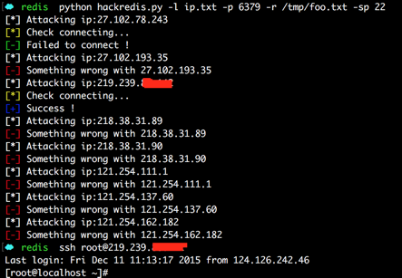

# hackredis
之前@Matt写了一个批量扫描redis未授权的[脚本](https://github.com/code-scan/rescan)。然后我根据[Redis未授权访问导致可远程获得服务器权限](http://www.freebuf.com/vuls/85021.html)写了一个批量获取的脚本。暂时还没写多线程，写的很烂，凑活用吧。

**安装依赖**
```
☁  ~ sudo easy_install redis
```

**使用**
```
☁  redis  python hackredis.py                                  
usage: hackredis.py [-h] [-l IPLIST] [-p PORT] [-r ID_RSAFILE] [-sp SSH_PORT]

For Example:
-----------------------------------------------------------------------------
python hackredis.py  -l ip.txt -p 6379 -r foo.txt -sp 22

optional arguments:
  -h, --help     show this help message and exit
  -l IPLIST      the hosts of target
  -p PORT        the redis default port
  -r ID_RSAFILE  the ssh id_rsa file you generate
  -sp SSH_PORT   the ssh port
```

首先需要ssh密钥:
```
☁  ~  ssh-keygen -t rsa
☁  ~  cp ~/.ssh/id_rsa.pub /tmp/foo.txt
```

之后将ip列表填入ip.txt，然后就可以跑了。
成功的将会输出到success.txt,执行成功但是ssh连接失败的会存储在unconnect.txt，操作失败的会存储在fail.txt。

测试截图：


